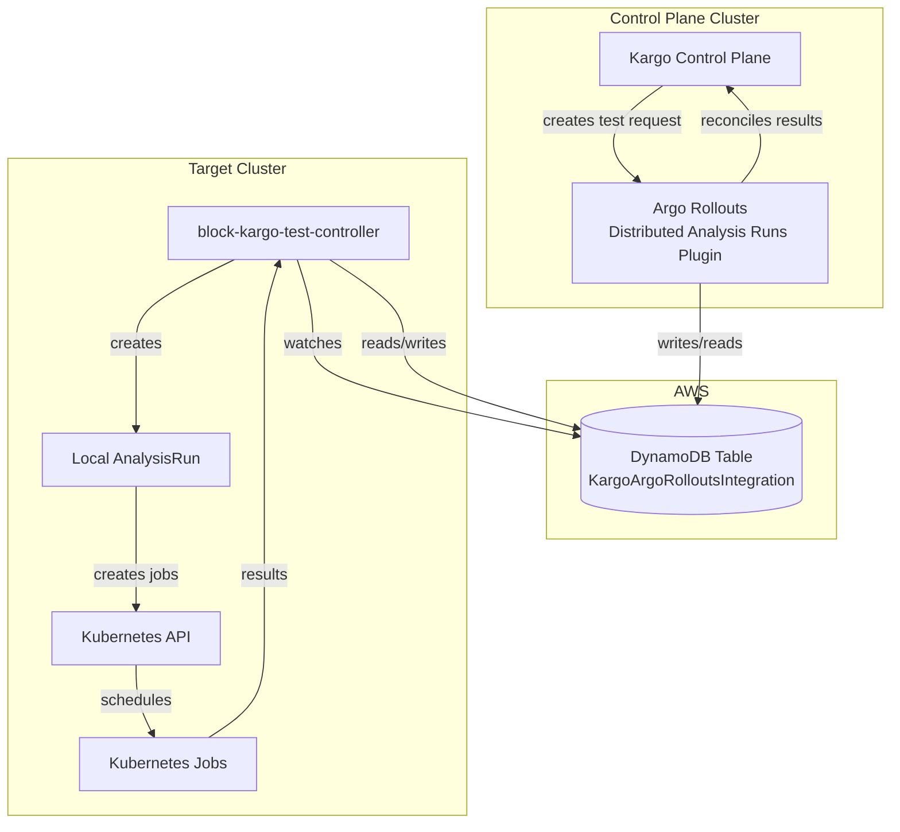

# rollouts-plugin-distributed-analysis-runs

**Distributed Analysis Execution via DynamoDB**

The `rollouts-plugin-distributed-analysis-runs` is a plugin designed for use with the Argo Rollouts plugin system. This plugin **distributes the execution of analysis run tests** by using DynamoDB as a shared communication point. Analysis templates specified in the configuration are executed by the [block-kargo-test-controller](https://github.com/squareup/block-kargo-test-controller), which writes the results back to DynamoDB, enabling distributed analysis execution across multiple Kubernetes clusters and AWS accounts.

## Distributed Analysis Execution

This plugin **distributes the execution of analysis run tests** by using DynamoDB as a shared communication point:



### Workflow Phases

1. **Write Phase**: The plugin writes analysis run metadata (AnalysisRunUid, AnalysisTemplate, ClusterID, Namespace) to DynamoDB
2. **Execution Phase**: The [block-kargo-test-controller](https://github.com/squareup/block-kargo-test-controller) reads the analysis request from DynamoDB and executes the specified analysis template
3. **Result Phase**: The controller writes the `Result` attribute back to DynamoDB
4. **Poll Phase**: The plugin polls DynamoDB for the `Result` attribute
5. **Evaluation Phase**: When `Result` is set, the plugin evaluates:
   - `Result == "Passed"` → Analysis succeeds
   - `Result != "Passed"` → Analysis fails

### Execution Controller

The analysis templates specified in the plugin configuration are executed by the **[block-kargo-test-controller](https://github.com/squareup/block-kargo-test-controller)**. This controller:

- Monitors DynamoDB for new analysis run requests
- Executes the specified analysis templates
- Writes the test results back to DynamoDB as the `Result` attribute
- Enables distributed execution of analysis tests across clusters

> [!IMPORTANT]
> This plugin uses DynamoDB as a **distributed communication point** for multi-cluster scenarios. Analysis templates are executed by the block-kargo-test-controller, which reads requests from DynamoDB and writes results back, enabling distributed analysis execution across multiple Kubernetes clusters and AWS accounts.

## Features

- **Multi-Cluster Coordination:** Uses DynamoDB as a distributed communication point for cross-cluster analysis runs
- **Polling Mechanism:** Polls DynamoDB for result status until completion or timeout
- **IRSA Support:** Automatically uses IAM Roles for Service Accounts (IRSA) for AWS authentication
- **Configurable Polling:** Customizable poll interval and timeout settings
- **Default Values:** Sensible defaults for table name and AWS region
- **Error Handling:** Robust error handling to ensure reliable operation
- **Debugging Support:** Provides options for building debug versions and attaching debuggers

## Build & Debug

To build the plugin, use the following commands:

### Release Build

```bash
make build-rollouts-plugin-distributed-analysis-runs
```

### Debug Build

```bash
make build-rollouts-plugin-distributed-analysis-runs-debug
```

### Attaching a debugger to debug build

If using goland you can attach a debugger to the debug build by following the directions https://www.jetbrains.com/help/go/attach-to-running-go-processes-with-debugger.html

You can also do this with many other debuggers as well. Including cli debuggers like delve.

## Using a Metric Plugin

There are two methods of installing and using an argo rollouts plugin. The first method is to mount up the plugin executable
into the rollouts controller container. The second method is to use a HTTP(S) server to host the plugin executable.

### Mounting the plugin executable into the rollouts controller container

There are a few ways to mount the plugin executable into the rollouts controller container. Some of these will depend on your
particular infrastructure. Here are a few methods:

- Using an init container to download the plugin executable
- Using a Kubernetes volume mount with a shared volume such as NFS, EBS, etc.
- Building the plugin into the rollouts controller container

Then you can use setup the configmap to point to the plugin executable. Example:

```yaml
apiVersion: v1
kind: ConfigMap
metadata:
  name: argo-rollouts-config
data:
  plugins: |-
    metrics:
    - name: "block/rollouts-plugin-distributed-analysis-runs" # name of the plugin uses the name to find this configuration, it must match the name required by the plugin
      location: "file://./my-custom-plugin" # supports http(s):// urls and file://
```

### Using a HTTP(S) server to host the plugin executable

Argo Rollouts supports downloading the plugin executable from a HTTP(S) server. To use this method, you will need to
configure the controller via the `argo-rollouts-config` configmaps `pluginLocation` to an http(s) url. Example:

```yaml
apiVersion: v1
kind: ConfigMap
metadata:
  name: argo-rollouts-config
data:
  plugins: |-
    metrics:
    - name: "block/rollouts-plugin-distributed-analysis-runs" # name of the plugin uses the name to find this configuration, it must match the name required by the plugin
      location: "https://github.com/squareup/rollouts-plugin-distributed-analysis-runs/releases/download/v0.0.1/rollouts-plugin-distributed-analysis-runs-linux-amd64" # supports http(s):// urls and file://
```

### Sample Analysis Template

This plugin writes analysis run metadata to DynamoDB and polls for a `Result` attribute. An external system (in another cluster or AWS account) reads the request, performs validation, and writes the result back to DynamoDB.

**Configuration Options:**
- `table_name`: DynamoDB table name (default: `KargoArgoRolloutsIntegration`)
- `region`: AWS region (default: `ap-southeast-2`)
- `cluster_id`: Cluster identifier for multi-cluster coordination
- `analysis_template`: Name of the analysis template
- `namespace`: Kubernetes namespace
- `poll_interval`: Polling interval in seconds (default: 5)
- `poll_timeout`: Polling timeout in seconds (default: 300)

**How it works:**
1. Plugin writes entry to DynamoDB with `AnalysisRunUid`, `AnalysisTemplate`, `ClusterID`, `Namespace`
2. [block-kargo-test-controller](https://github.com/squareup/block-kargo-test-controller) reads the request and executes the specified `AnalysisTemplate`
3. Controller writes the `Result` attribute back to DynamoDB
4. Plugin polls DynamoDB for `Result` attribute
5. When `Result` is set:
   - `Result == "Passed"` → Analysis succeeds
   - `Result != "Passed"` → Analysis fails with error

An example Analysis Template:

```yaml
apiVersion: argoproj.io/v1alpha1
kind: AnalysisTemplate
metadata:
  name: multicluster-test
spec:
  metrics:
    - name: multicluster-test
      interval: 30s
      failureLimit: 3
      count: 5
      provider:
        plugin:
          block/rollouts-plugin-distributed-analysis-runs:
            table_name: KargoArgoRolloutsIntegration  # Optional, defaults to KargoArgoRolloutsIntegration
            region: ap-southeast-2                # Optional, defaults to ap-southeast-2
            cluster_id: "cluster-1"               # Required: Cluster identifier
            analysis_template: "template name"    # Required: Template name
            namespace: "kargo-demo"               # Required: Kubernetes namespace
            poll_interval: 5                      # Optional, defaults to 5 seconds
            poll_timeout: 300                     # Optional, defaults to 300 seconds
```

### Distributed Execution Workflow

1. **Cluster A** (Argo Rollouts): Plugin writes analysis request to DynamoDB with `AnalysisTemplate`, `ClusterID`, `Namespace`, and `AnalysisRunUid`
2. **block-kargo-test-controller** (running in any cluster/account):
   - Monitors DynamoDB for new analysis requests
   - Reads the request using `AnalysisRunUid` and `ClusterID`
   - Executes the specified `AnalysisTemplate`
   - Writes `Result = "Passed"` or `Result = "Failed"` back to DynamoDB
3. **Cluster A**: Plugin polls DynamoDB and reads the result, then succeeds or fails accordingly

This enables **distributed analysis execution** where analysis templates are executed by the block-kargo-test-controller, which can run in a different cluster or AWS account from where the Argo Rollouts analysis run was initiated.

### DynamoDB Table Schema

The plugin expects a DynamoDB table with the following schema:

**Partition Key:** `AnalysisRunUid` (String)  
**Sort Key:** `ClusterID` (String)

**Attributes:**
- `AnalysisRunUid`: Unique identifier for the analysis run (from Kubernetes UID)
- `ClusterID`: Cluster identifier for multi-cluster coordination
- `AnalysisTemplate`: Name of the analysis template
- `Namespace`: Kubernetes namespace
- `Timestamp`: RFC3339 timestamp when the entry was created
- `Result`: Result of the analysis (set by [block-kargo-test-controller](https://github.com/squareup/block-kargo-test-controller))
  - `"Passed"` → Analysis succeeds
  - Any other value → Analysis fails

**Example DynamoDB Item:**
```json
{
  "AnalysisRunUid": "01kaavwrj616n4hva5ng54advn.e945066",
  "ClusterID": "cluster-1",
  "AnalysisTemplate": "dynamodb-multicluster-test",
  "Namespace": "kargo-demo",
  "Timestamp": "2025-11-18T06:55:13Z",
  "Result": "Passed"
}
```
